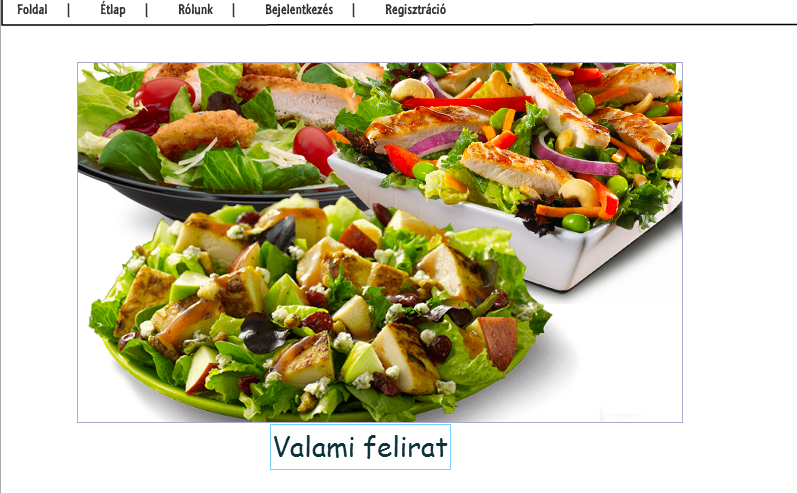

#Dokumentáció

##Követelmények

###Célkitűzés
A project fő célja egy olyan (kitalált) étterem honlapjának elkészítése amit akár a valóságban is használhatna.
Fontos volt hogy hogy az információk megtekintése mellett a felhasználók bejelentkezés után leadhassák rendelésüket,
illetve az étteremtulajdonos belépés után nyomon tudja követni őket.

###Funkcionális elvárások
####Felhasználói szemszögből
* Felhasználóként szeretném megnézni az oldal főoldalát, az étlapot és az étterem információs oldalát hogy megtudjam érdemes-e regisztrálni
* Szeretnék tudni regisztrálni
* Szeretnék tudni bejelentkezni
* Szeretnék tudni kijelentkezni
* Szeretném módosítani az adataimat
* Szeretnék rendelni és visszajelzést kapni ennek sikerességéről

####Adminisztrátori szemszögből
* Szeretném elérni az összes funkciót amit a felhasználók is elérniek
* Ezen felül szeretném megtekinteni a beérkezett rendeléseket, és törölni a már teljesítetteket

###Nem funkcionális követelmények
* Felhasználóbarát, mobile-friendli ergonomikus design
* Gyors működés
* Biztonságos működés

###Szerepkörök
**vendég**: meg tudja tekinteni a főoldalt, az étlapot és az információs oldalt, tud regisztrálni, de rendelni nem tud

**felhasználó**: a vendék körét bővíti ki az adatok módosításának lehetőségével és ő már tud rendelni is

**adminisztrátor**: a felhasználó körét bővíti ki, megtekintheti az eddig leadott rendeléseket és törölhet közülük

###Használati esetek

###Folyamatábra

##Tervezés

###Architectura terv
####Oldaltérkép
Publikus:

- index
- aboutus
- menu
- signUp
- login

Felhasználó:

- index
- aboutus
- menu
  - rendelés leadása
- signUp
- login/logout

Admin:

- index
- aboutus
- menu
  - rendelés leadása
- signUp
- login/logout
- orders
  - rendelés törlése

####Végpontok

* GET  / föoldal
* GET  /login bejelentkező oldal
* POST /login bejelentkezési adatok felküldése
* GET  /signUp regisztrációs oldal
* POST /signUp Regisztrációs adatok felküldése
* GET  /aboutus informásiós oldal
* GET  /menu étlap megtekintése
* POST /menu rendelés elküldése
* GET  /orders rendelések megtekintése
* POST /orders rendelés törlése

###Felhasználóifelület-modell
####Oldalvázlatok

Főoldal

Rólunk

Étlap

Rengelések

Regisztráció

###Osztálymodell

##Implementáció
###Fejlesztői környezet
Az alkalmazást a cloud9 fejlesztői környezet segítségével fejlesztettem
###Könyvtárstruktúra
- **docd** ide kerülnek a dokumentumok
  - **images** ide kerülnek a dokumentumokhoz tartozó képek
- **json** mivel ebben a beadandóban nem szabadott adatbázist használni a különböző adatokat json-okba mentettem amiket ide helyeztem el
- **node_modules** ide kerülnek a dependenciák. Az általam felhasznált dependenciák a következők: express, body-parser, hbs, md5
- **public** ide azok a statikus dolgok kerülnek mappákba szervezve amiket az oldalak el tudnak érni
  - **CSS**
  - **JS**
  - **images**
- **views** a különböző nézetek

##Tesztek